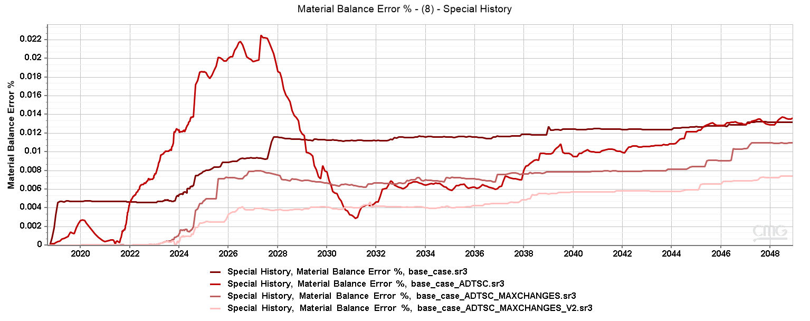
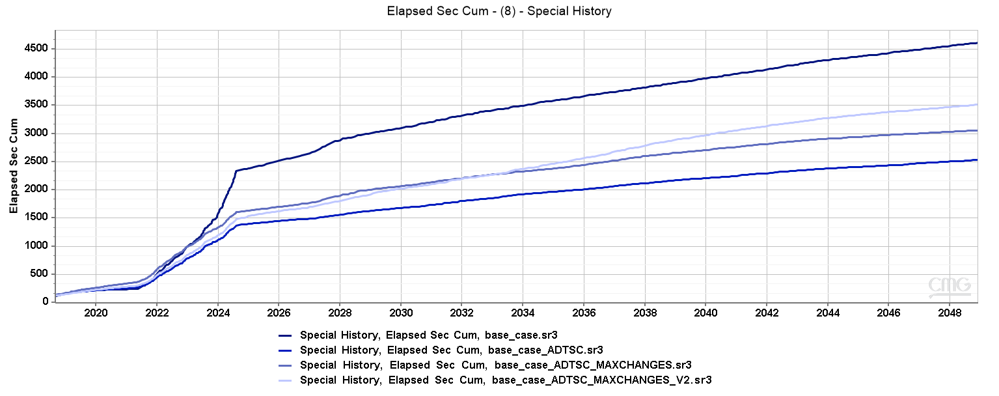

* Tests to improve simulation speed
    * Number of CPUs.
        * Tested with 6 to 12 CPUs.
        * Two runs to account for differences in the servers (additional runs if results are too different).
        * Best results with 10 CPUs, but with 6 was quite close.
        * Additional runs with 6 and 10 CPUs ...
        * **It was decided to use 6 CPUs**.
    * Numerical controls.
        * Tested with ADTSC (automatic time-steping), and ADTSC + defined MAXCHANGES and NORM.
        * ADTSC have a significant impact on the elpased time, but a negative effect on material balance.
        * A tighter NORM was tested (V2). It reduced material balance error, but increased simulation time.
        * The first test was with 10 CPUs. A second test was performed with 6 CPUs.
        * xxx ....
        * It was preferred to use **ADTSC with the initial MAXCHANGE and NORM values**.

        
        
        