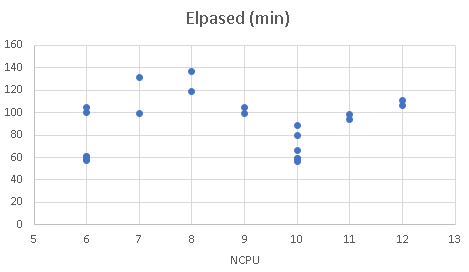
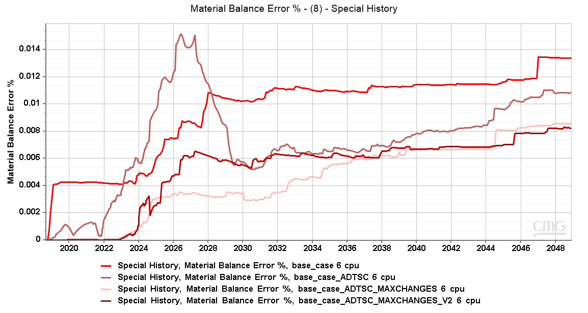
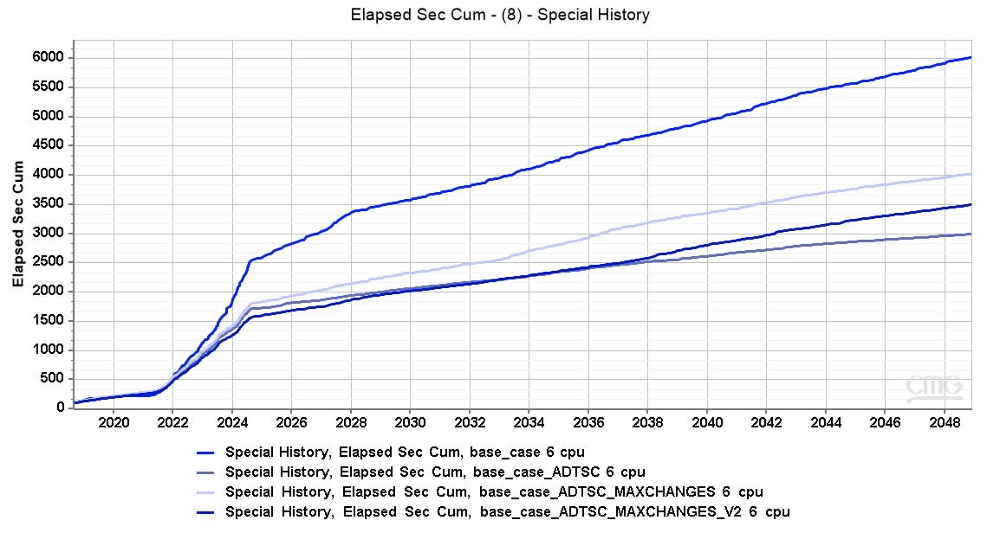
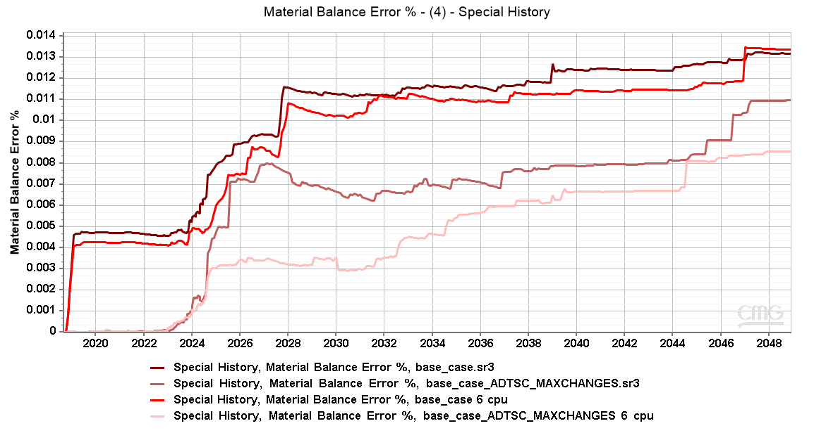
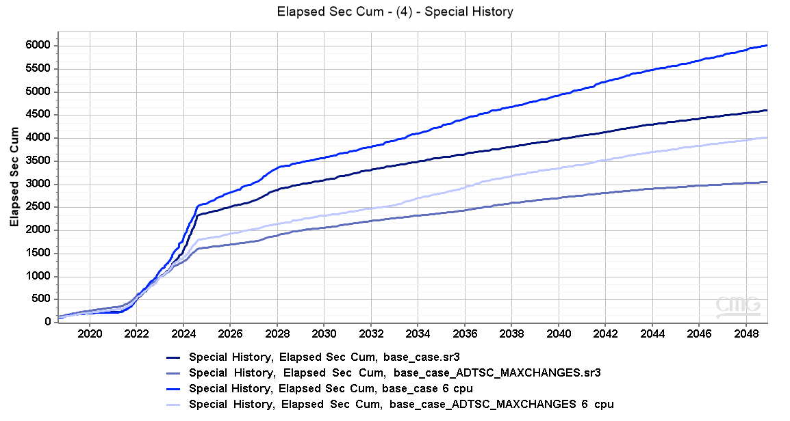

* Tests to improve simulation speed
    * Number of CPUs.
        * Tested with 6 to 12 CPUs.
        * Two runs to account for differences in the servers.
            * Four additional runs with 6 and 10 CPUs.
        * Best results with 10 CPUs.
        * With 6 CPUs there is a wider spread in the results. The best ones are quite close to 10 CPUs.
        * Although some simulations were a bit slower, with 6 CPUs there's a 40% reduction in usage. **It was decided to use 6 CPUs in all future simulations**.
        
        

    * Numerical controls.
        * Tested with ADTSC (automatic time-steping), and ADTSC + defined MAXCHANGES and NORM.
        * ADTSC have a significant impact on the elpased time, but a negative effect on material balance.
        * A tighter NORM was tested (V2). It reduced material balance error in some tests, but increased simulation time.
        * The first test was with 10 CPUs. A second test was performed with 6 CPUs.
            * The results with 6 CPUs follows the results with 10 CPUs. 
        * It was preferred to use **ADTSC with the initial MAXCHANGE and NORM values**.
                
        
        
        

        
        
        