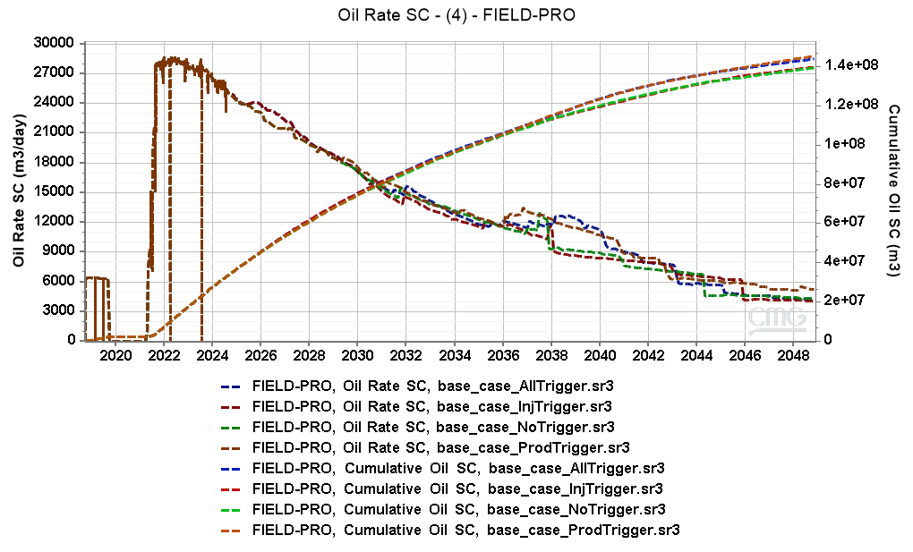
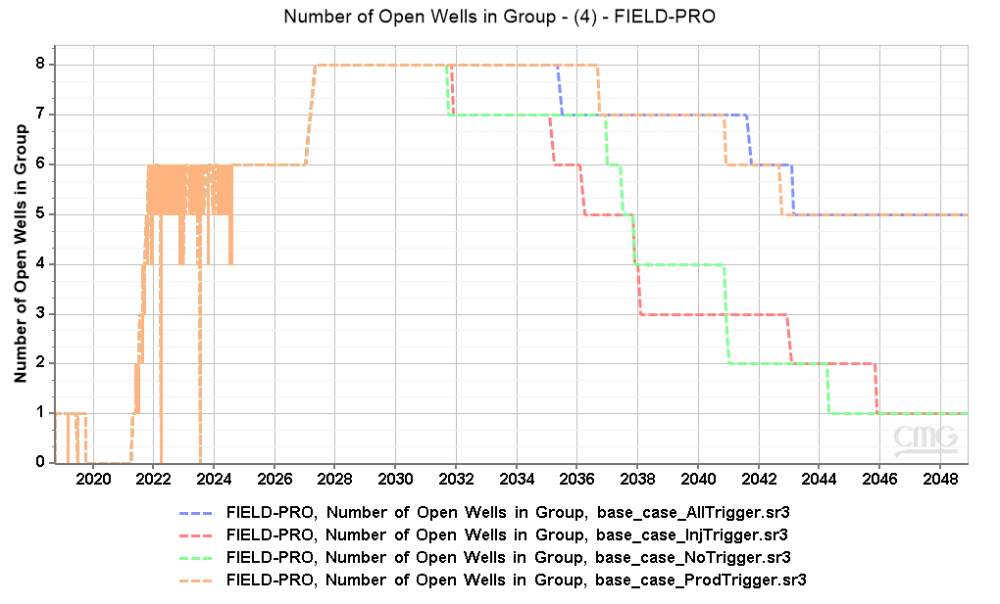
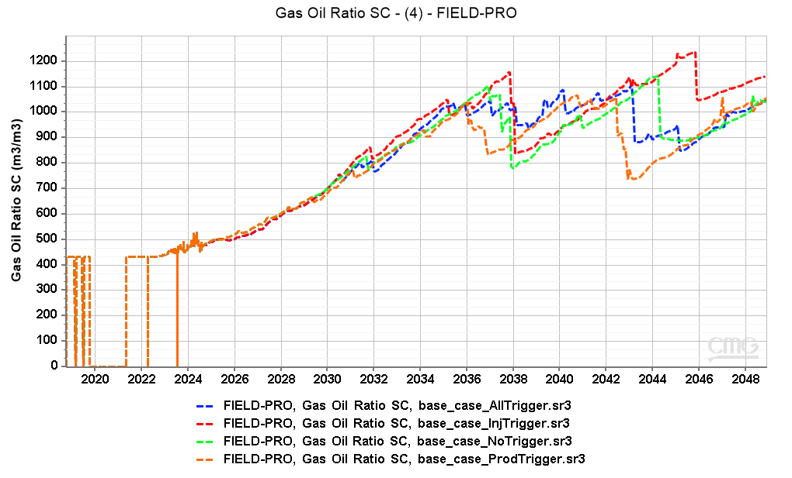
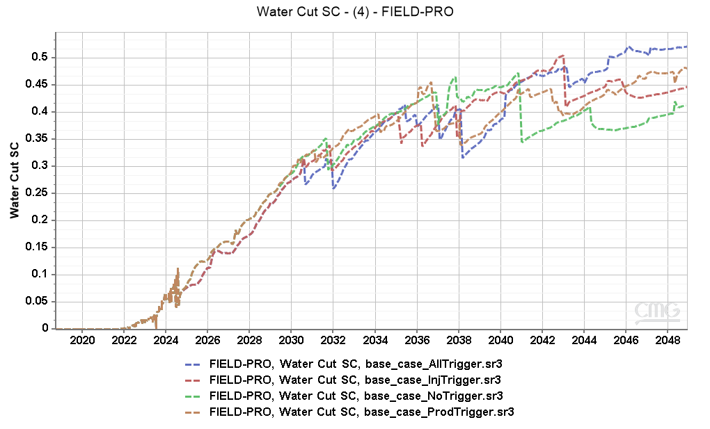
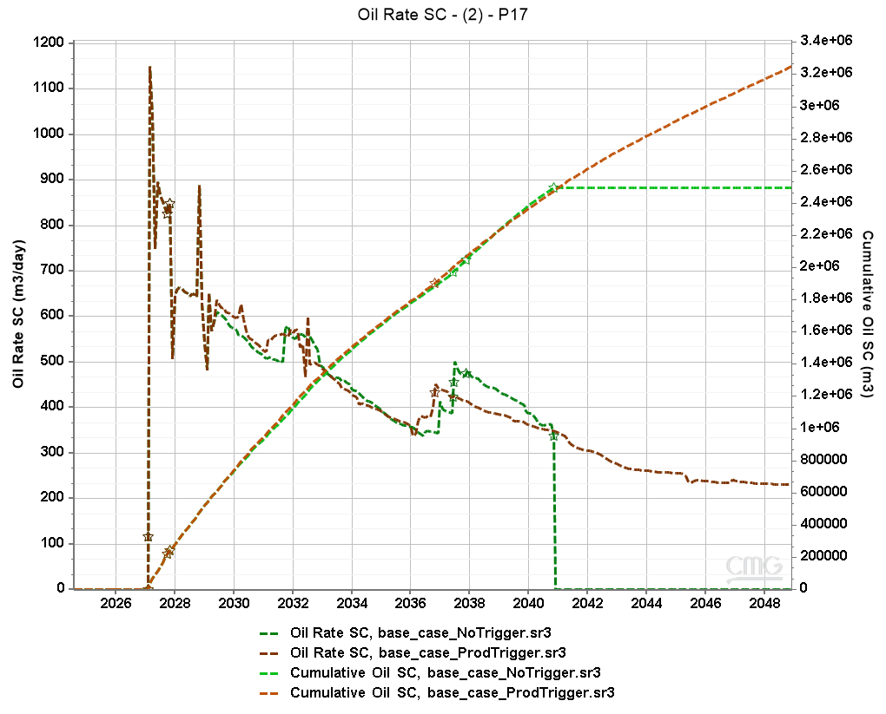
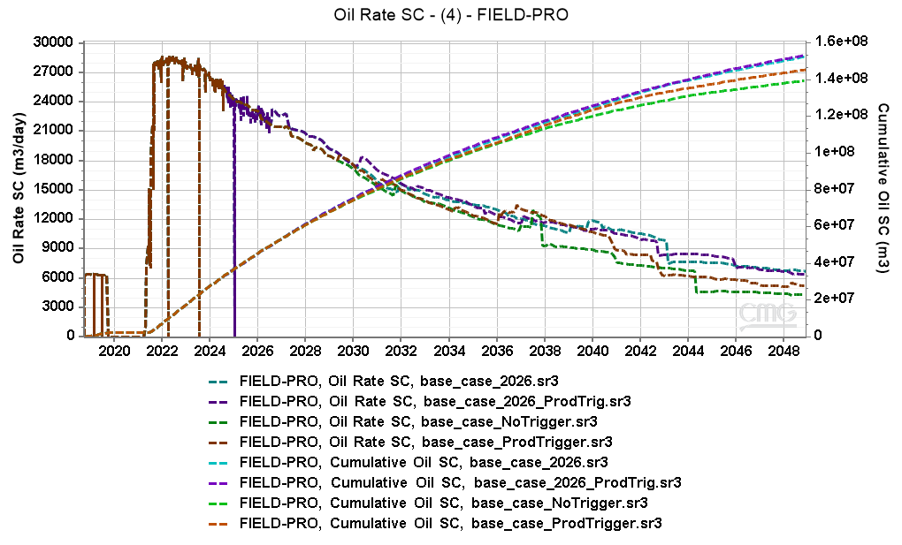

* The trigger for producers closes producers' completion intervals that reach a GOR limit of 1600 m3/m3.
    * This trigger has a positive, although modest, effect on overall oil recovery.
    * With the trigger the producers are open for longer, as the intervals with high GOR are shut.
    * Production increase is associated to the wells that previously shut down due to high GOR.
    * Impact is very small in the 2026 version.
* The trigger for injectors change the upper and lower completions based on the cumulative injection, balancing the intervals.
    * There's no meaningful impact on production.

* **Only production triggers will be used in the tests. The base case will be without any trigger.**
    
    
    
    

    

    
    
    
    
    